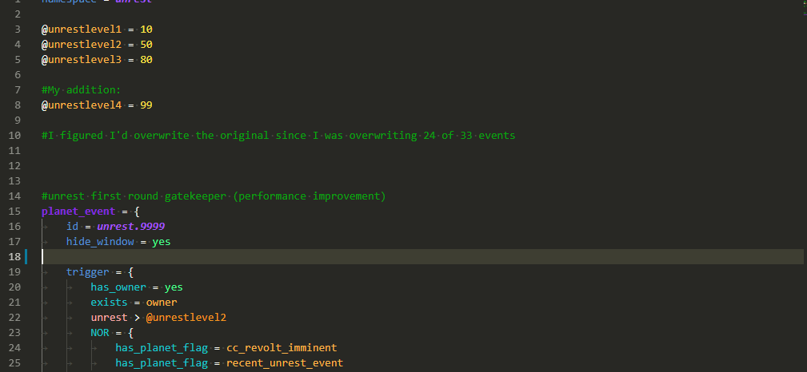
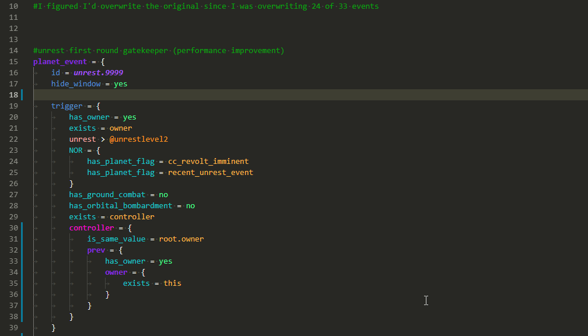
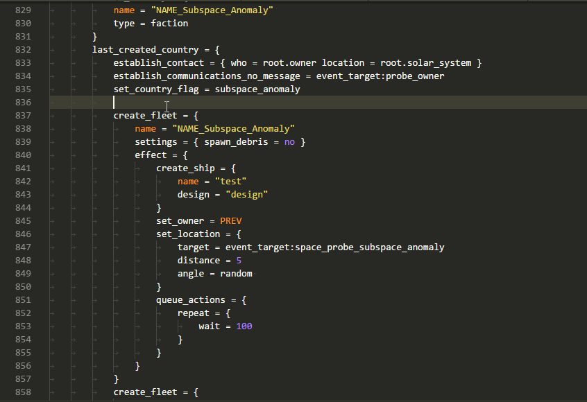
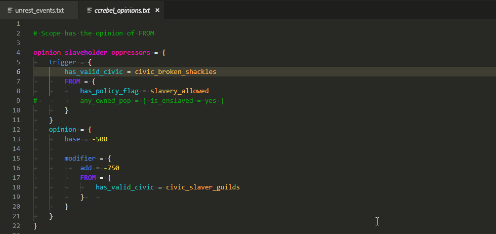

# [CWTools: Paradox Language Services](https://marketplace.visualstudio.com/items/tboby.cwtools-vscode)

**Paradox Language Features for Visual Studio Code**

## Disclaimer

This extension is still in preview, it may not work, it may stop working at any time.
**Make backups of your mod files.**

## Supported games

* Imperator: Rome
* Stellaris
* Europa Universalis IV
* Crusader Kings II - coming soon
* Hearts of Iron IV - coming soon

## Features

* Immediate highlighting of syntax errors
* Autocomplete while you type, providing descriptions when available
* Tooltips on hover showing:
  * Related localisation
  * Documentation for that element
  * Scope context at that position
* A wide range of validators for common, interface, and events, checking
  * That required localisation keys are defined
  * Existence of effects/triggers/modifiers
  * Scope context for used effects/triggers/modifiers
  * Usage of scripted effects/triggers
  * Correct entries for weights/AI_chance/etc
  * That event\_targets are saved before they're used
  * That referenced sprites and graphics files exist
  * and a number of other specific validators
* "Code actions" to generate .yml for missing localisation

### Completion

### Tooltips

### Scope tooltips

### Scope errors

### Localisation error

### Go to definition

### Find all references

## Usage

1. Install this extension
2. If on linux, possibly follow [these instructions](https://code.visualstudio.com/docs/setup/linux#_error-enospc)
3. If on linux, install libcurl3
4. Either open your mod folder directly
5. or open the Game folder containing your mods. E.g. for Stellaris this can be one of:
    * "C:\Users\name\Paradox Interactive\Stellaris"
    * "C:\Program Files(x86)\Steam\steamapps\common\Stellaris"

    or on linux
    * "/home/name/.local/share/Paradox Interactive/Stellars"
    * "/home/name/.steam/steam/steamapps/common/Stellaris"
6. Follow the prompts to select your vanilla folder
7. Edit files and watch syntax errors show up when you make mistakes
8. Wait up to a minute for the extension to scan all your mods and find all errors

## Links 
* [vic2-config](https://github.com/cwtools/cwtools-vic2-config)
* [ck2-config](https://github.com/cwtools/cwtools-ck2-config)
* [eu4-config](https://github.com/cwtools/cwtools-eu4-config)
* [hoi4-config](https://github.com/cwtools/cwtools-hoi4-config)
* [stellaris-config](https://github.com/cwtools/cwtools-stellaris-config)
* [ir-config](https://github.com/cwtools/cwtools-ir-config)
